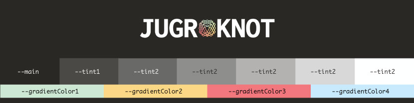

# JUGR-KNOT
A chess-based puzzle game

## About
JUGR-KNOT is a strategy game based on the chess concept of a Knight's Tour. A Knight's Tour is a sequence of movements by a single knight that results in every square on the chess board being occupied exactly once.


### For Devs

The majority of the game is encapsulated in a class called `gameBoard`. See below for a skeleton of this class.

```
class gameBoard{
  constructor(level, multiplayer){
    this.level= level;
    this.size = 0;
    this.move = 0;
    this.moves = [];
    this.squares = [];
    this.gameboard = document.querySelector("#domGame");
    this.movesBTN = null;
    this.domButtons = [];
    this.validMoves = [];
    this.invalidMoves = [];
    this.multiplayer = multiplayer;
    this.players = [{name:"Player 1", id:"a", move: 0, moves: [], validMoves:[],invalidMoves:[]},{name:"Player 2", id:"b", move: 0, moves: [], validMoves:[],invalidMoves:[]}];
    this.player = null;
    this.opponent = null;
    this.boundValidMoves = this.returnValidMoves.bind(this);
    this.boundListMoves = this.listMoves.bind(this);
  }
  setSize(){...}
  createColumns(){...}
  setPlayer(){...}
  returnValidMoves(e){...}
  isGameOver(){...}
  listMoves(){...}
  setSquareListeners(){...}
  createAndSetReset(){...}
}
```

A function called `makeGame` resets DOM elements, creates a new instance of a game class, and repopulates DOM elements when the page loads, the reset button is clicked, a new difficulty level is selected, or the user toggles multiplayer mode.

## How to play

### Single Player

Your mission is simple—attempt to disable every single square on a grid size of your choosing. Starting at level 1 is a good idea but it's your choice. You lose if you run out of valid moves before disabling all squares on the grid.

#### For Devs

Each square has a data attributes that include x and y axis values. Upon selecting a square to play, valid moves and invalid moves are reduced from the main nodelist of buttons to return a nested array. 

```
let x = parseInt(e.currentTarget.dataset.x);
    let y = parseInt(e.currentTarget.dataset.y);
    let domButtons = Array.from(this.domButtons)
    let knightMoves = domButtons.reduce((a,elem)=>{
      if(
        parseInt(elem.dataset.x) === x-2 && parseInt(elem.dataset.y) === y-1 ||
        parseInt(elem.dataset.x) === x-2 && parseInt(elem.dataset.y) === y+1 ||
        parseInt(elem.dataset.x) === x-1 && parseInt(elem.dataset.y) === y-2 ||
        parseInt(elem.dataset.x) === x-1 && parseInt(elem.dataset.y) === y+2 ||
        parseInt(elem.dataset.x) === x+2 && parseInt(elem.dataset.y) === y-1 ||
        parseInt(elem.dataset.x) === x+2 && parseInt(elem.dataset.y) === y+1 ||
        parseInt(elem.dataset.x) === x+1 && parseInt(elem.dataset.y) === y-2 ||
        parseInt(elem.dataset.x) === x+1 && parseInt(elem.dataset.y) === y+2
        ){
          a[0].push(elem);
        }else{
          a[1].push(elem);
        }
        return a;   
    },[[],[]]
```

In this case, `a[0]` contains valid moves and `a[1]` contains invalid moves. These are pushed to the `validMoves` and `invalidMoves` properties on the object each turn. 

When a square is played, its x and y values are set to "played" so they won't be included in future options for valid moves. 

### Multiplayer

Battle head to head with a friend—or enemy—to determine who is the most cunning knight. The first player to run out of valid moves loses.

## Style guide

Please adhere to these guidelines for the immediate future when developing new features or refactoring code.

### Typography

#### Inconsolata

Inconsolata is a monospace font that enables equal spacing on each side of the knot logo in the JUGR-KNOT lock up. As of now it should only be used in this capacity. 

Importing and using Inconsolata in CSS:

```
@import url('https://fonts.googleapis.com/css2?family=Inconsolata:wght@800&display=swap');
font-family: 'Inconsolata', monospace;
```

[Read more about Inconsolata](https://fonts.google.com/specimen/Inconsolata/about?query=incon&preview.text=JUGR-KNOT&preview.text_type=custom)

#### Helvetica

Helvetica should be the first font-family listed in all element stacks, absent the JUGR-KNOT lock up. Absent Helvetica, Arial is an appropriate substitute. This is necessary as we are not currently importing Helvetica.

Required font-stack:

```
font-family: helvetica, arial, sans-serif;
```

### Spacing

For the sake of consistency and maintaining a visual heirarchy it is necessary to adhere to this basic rule whenever you declare spacing within or between elements on the page: the 8px rule.

#### The 8px rule

Whereever a CSS rule is declared that impacts the spacing between elements (margin properties) or within elements (padding properties), the value of the property declared should be a divisor OR multiple of 8. As such the smallest declared spacing might be 2px and may go up to 32px, 64px, etc.

Note: This only applies to explicitly delared spacing in static units and does not account for variable spacing like auto properties on margins or flex properties that justify content in particular ways.

### Color

All colors are declared in CSS variables with values corresponding to R,G,B values of the color assigned. No colors should be assigned in CSS properties without referencing the associated variable. This practice encourages adherence to style guides and enables greater scalability and maintainability of code.  For instance, the main color in darkmode is a dark grey. See how it is declared, used, and compiled below.

Variable declaration:
```
--main: 43,41,38;
```

Variable in use:
```
background: rgba(var(--main), 1);
```

Compiled:
```
background: rgba(43,41,38,1);
```

Note how this format still enables one to take advantage of the alpha value in rgba. Consider writing all color assignments in rgba format for easy manipulation of opacity in the future for user interactions, transitions, etc. 

#### Darkmode



##### main
```
--main: 43,41,38;
```

##### tint1
```
--tint1: 74,72,69;
```

##### tint2
```
--tint2: 104,105,103;
```

##### tint3
```
--tint3: 141,140,138;
```

##### tint4
```
--tint4: 178,177,176;
```

##### tint5
```
--tint5: 216,215,215;
```

##### tint6
```
--tint6: 252,252,252;
```

##### gradientColor1
```
--gradientColor1:198,255,221;
```

##### gradientColor2
```
--gradientColor2:251,215,134;
```

##### gradientColor3
```
--gradientColor3:247,121,125;
```

##### gradientColor4
```
--gradientColor4:198, 239, 255;
```

#### Lightmode

Lightmode style guide is still in development. In the interim, the pallete for lightmode is a simple inversion of the darkmode pallete. 

## Roadmap

### History

- Initial logic for proof of concept
- Initial layout in HTML/CSS
- Responsivity for mobile
- Dropdown menu for selection of various levels of difficulty
- Toggle button that displays moves history for current game
- Toggle button for switching between multiplayer
- Initial logic for multiplayer gameplay
- Toggle input for darkmode/lightmode

### Future

A look into what the future could hold for this project. Many of these tasks can be executed out of order but should be read as ordered by level of priority.

- Address potential accessibility concerns on demo:
  - better semantic mark-up
  - color contrast in both light and darkmode
  - ability to toggle animations/transitions
  - better clarity regarding what buttons and inputs do
- Refactor code for improved abstraction so as to maximize efficiency and minimize complexity
- Functionality that enables users to copy moveslist to clipboard with a click/tap instead of hightlighting and copying a list
- Develop and implement better articulated style guide for lightmode and darkmode
- Make info section/subsections collapsable/expandable
- Add a timer function and score to foster competition among users
- Add ability to create an account/profile for additional features:
  - Saving and reviewing the moves list for previous games
  - Ranking users by score/time on each level
  - Enabling users to play against eachother in multiplayer mode
- Create new grids of uneven dimensions
  - Rectangles
  - Grids with gaps/obstacles that require more precise tour execution to navigate

