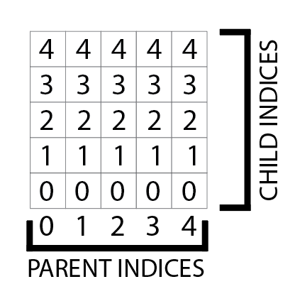
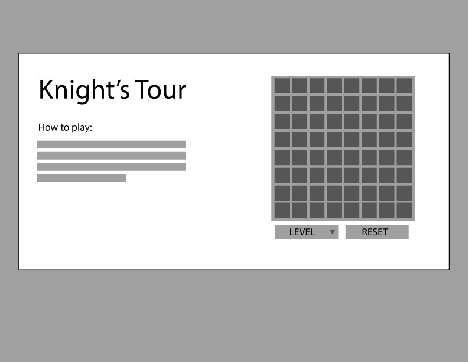
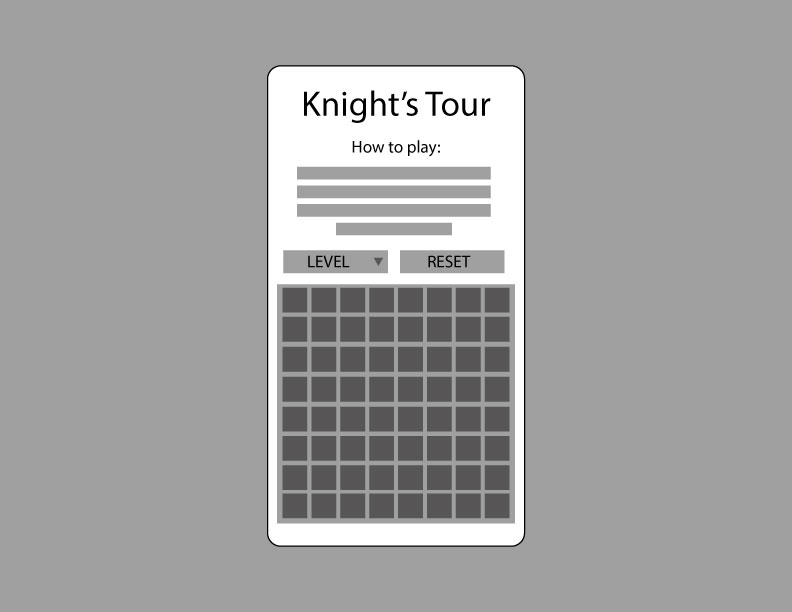

# knightsTour
A chess-based puzzle game

## Context
> A knight's tour is a sequence of moves of a knight on a chessboard such that a knight visits every square exactly once.
- From the [Wikipedia article on the Knight's Tour](https://en.wikipedia.org/wiki/Knight%27s_tour)

## Proposal
The user experience of my Knight's Tour game will be very similar to my tic-tac-toe game in layout and interaction. The user will be able to click or tap box elements laid out in a grid.

The game starts when a user taps the first square, which then becomes disabled. From there I hope to highlight valid moves on the grid--squares that 1) follow the rules of how a knight moves 2) are not disabled from previous taps.

If no valid moves are left but there are untapped squares in play then the player loses. If the user disables all the squares then the player wins.

Possible bonus considerations if I have time:

1. An input that allows the user to generate a grid of variable numbers within a reasonable range (for display purposes). This would enable a player to start off on a 5x5 grid and level up for a greater challenge.

2. While this is a single player game, I considered the possibility of a turn based version in which one user tries to "dead-end" the other out of valid moves.

## How to get started
I think I'll be able to leverage the experience I gained building tic-tac-toe logic while developing this. One hurdle I face is that knights have a unique movement pattern that I'll have to figure out how to program. If I can crack this in a way that is scalable then the grid size will be arbitrary.

My first order of business is figuring out how the elements on the dom relate to each other and how to work out.

I'm thinking about setting up the gameboard as nested arrays like below

```
[
  [0, 1, 2, 3, 4, 5, 6, 7],
  [0, 1, 2, 3, 4, 5, 6, 7],
  [0, 1, 2, 3, 4, 5, 6, 7],
  [0, 1, 2, 3, 4, 5, 6, 7],
  [0, 1, 2, 3, 4, 5, 6, 7],
  [0, 1, 2, 3, 4, 5, 6, 7],
  [0, 1, 2, 3, 4, 5, 6, 7],
  [0, 1, 2, 3, 4, 5, 6, 7]
]
```

I haven't fully thought this out but I'm thinking I can 1) add event listeners to detect click for each element on the game board 2) access the index value of that event 3) evaluate valid moves.

This matrix makes the movements more intuitive (I hope). For instance, if a user clicks on `arr[2][2]` then they have 8 potential moves: `[0][1], [0][3], [1][0], [1][4], [3][0],[3][4], [4][1],[4][3]` and of these the program will have to loop through to determine if they're disabled.

This is better visualized in the attached image below.



## TRELLO BOARD

My Trello board for this project can be [found here](https://trello.com/invite/b/rPiDi0oT/67a3ee1760ee709d29f385ca3ec19a67/knights-tour-project).

## WIREFRAMES

Below I've included initial concepting (subject to change).



